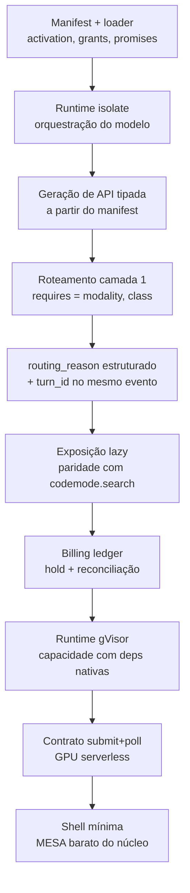

# Arquitetura — decisões

Documento de decisão, derivado de [`RESEARCH.md`](RESEARCH.md) (9 dossiês, evidência de
2025–2026 com fonte primária), de [`FEATURES.md`](FEATURES.md) (1.242 funcionalidades
catalogadas em 12 domínios, cada uma atribuída a um produto real) e de
[`CLOUDFLARE_OS.md`](CLOUDFLARE_OS.md) (5 dossiês adversariais sobre o concorrente aberto
em 05/08/2026, que fechou três das peças que este documento tratava como autorais).

Este arquivo **decide**. Onde a evidência contradisse a premissa de partida, a decisão
segue a evidência e o parágrafo diz isso explicitamente.

---

## 1. O que sobrou da tese depois da evidência

As oito irritações que motivaram o projeto, confrontadas com o que a pesquisa achou:

| # | Irritação original | Veredito | Consequência de desenho |
|---|---|---|---|
| 1 | Formas de extender despadronizadas | **Confirmada, e pior do que parecia** — Open WebUI tem 6 mecanismos; a matriz de 7 eixos × 10 mecanismos mostra que só **1 eixo** é irredutível | É o núcleo do produto. §2 |
| 2 | MCP é token-ineficiente | **Confirmada por medição** — 17,6k–55k tokens antes da primeira palavra; 4–32× uma CLI equivalente | Code-execution como modo de invocação. §3 |
| 3 | Falta de funcionalidades especialistas | **Confirmada** — modelos de 0,9–1,2B batem GPT-4o/Gemini 2.5 Pro em parsing de documento | Capacidade especialista é *capability*, não caso especial. §4 |
| 4 | Multimodalidade travada no mesmo modelo | **Confirmada** | Roteamento por metadado declarado. §4 |
| 5 | Incapacidade de rotear automaticamente | **Parcialmente desatualizada** — os 3 grandes já roteiam nativamente desde meados de 2025; o buraco real é cross-provider e cross-modalidade | Roteamento é por *capacidade declarada*, não por "dificuldade do prompt". §4 |
| 6 | Governança e billing | **Certa para chat UIs, errada como generalização** — Databricks/Kong/LiteLLM Enterprise já cobrem. O que ninguém faz é gravar a decisão de roteamento como campo estruturado | Não construir governança enterprise. Construir o campo que falta. §6 |
| 7 | Falta de micro sandboxes | **Refutada como lacuna de mercado** — AWS AgentCore e Cloudflare Sandbox SDK vendem exatamente isso, GA, preço publicado | Não construir orquestrador de sandbox. Consumir. §5 |
| 8 | Impossibilidade de usar GPU serverless | **Certa quanto à causa, errada quanto ao culpado** — Modal `.spawn()`, fal queue+webhook e Replicate webhook existem e são doc primária. As UIs nunca implementaram o lado cliente | Contrato submit+poll como padrão da casa. §5 |

**O buraco defensável, revisado em 2026-08-15 depois do Cloudflare OS** (ver
[`CLOUDFLARE_OS.md`](CLOUDFLARE_OS.md)): a Cloudflare abriu em 05/08/2026, sob Apache-2.0,
um produto que cobre code execution como invocação (§3), exposição lazy (§3.3) e sandbox
por padrão (§5) — no mesmo runtime, self-hostável. **Três das peças que este documento
tratava como autorais deixaram de ser.**

O que sobrou, e é estreito de propósito:

1. **Um campo `activation` em vez de duas categorias de objeto.** Cloudflare OS tem *mais*
   mecanismos, não menos: Gadget, Gatekeeper, Blueprint, conta singleton, binding ambiente.
   Sem manifest unificado, sem campo de ativação comum. A própria tabela de analogia deles
   fecha com `??? → agents`.
2. **Modelo especialista como o mesmo objeto que tool e skill.** Ninguém faz. A Cloudflare
   tem as peças no catálogo Workers AI (Whisper, EmbeddingGemma, reranker, Moondream 3) e
   **não montou o roteador**.
3. **`routing_reason` / `routing_policy_version` / `candidates_considered` como campo
   estruturado.** Ninguém expõe — nem o AI Gateway, nem o Cloudflare OS.

E não cobrem, como mecanismo de extensão: `before_request`, `after_response`,
`on_stream_chunk` nem `provider` plugável. Não existe filtro de pipeline de inferência lá.

---

## 2. O primitivo de extensão — **um só**

A pesquisa de fragmentação concluiu "2 primitivos bastam: Capability e Interceptor".
**Discordo, e a razão é o princípio nº 1 dos precedentes:** o VS Code declara *existência*
e *condição de ativação* no mesmo campo (`activationEvents`) — e é isso que colapsa o
segundo primitivo num campo do primeiro.

O eixo irredutível não é "que tipo de coisa é isso", é **"quem invoca"**. E "quem invoca"
é um dado, não um mecanismo.

### 2.1 A forma

Uma extensão é **um módulo com uma função e um manifest**. Sempre.

```
capability/
  manifest.toml      # o que é, quem invoca, do que precisa, o que promete
  main.{ts,py,rs}    # async fn(entrada) -> saída
```

```toml
name = "ocr"
version = "1.2.0"

# O ÚNICO campo que decide a natureza da extensão.
activation = "model"          # o modelo decide chamar → precisa de schema tipado
# activation = "before_request"   # o runtime chama num ponto fixo do ciclo
# activation = "after_response"
# activation = "on_stream_chunk"
# activation = "ui:message_action"  # o usuário clica
# activation = "provider"           # substitui a geração inteira

requires = { modality = "image", class = "ocr" }   # roteamento (§4)
grants   = ["net:api.ocr.example", "cpu:2s", "mem:256mb"]  # permissão (§5)

[promises]
input  = "{ image: bytes, lang?: string }"
output = "{ text: string, boxes: Box[] }"
```

`activation` decide três coisas de uma vez, e é a razão de não haver segundo primitivo:

| `activation` | Quem chama | De onde vem a assinatura | Modelo vê schema? |
|---|---|---|---|
| `model` | o modelo, escrevendo código | do autor, em `[promises]` | sim, lazy (§3) |
| `before_request` / `after_response` / `on_stream_chunk` | o runtime, ponto fixo | fixa pelo ponto | não |
| `ui:*` | o usuário, clicando | fixa pelo ponto | não |
| `provider` | o usuário, selecionando | fixa (request → stream) | não |

O código do autor tem a **mesma forma nos cinco casos** — `async fn(T) -> U`, mesmo
runtime, mesmo modelo de permissão, mesmo empacotamento, mesmo versionamento. Só a
origem de `T`/`U` muda. Isso é um primitivo com um campo, não dois primitivos com um
nome comum.

### 2.2 Mapeamento dos seis mecanismos do Open WebUI

| Mecanismo atual | Vira |
|---|---|
| **Tool** | `activation = "model"` |
| **MCP / OpenAPI tool server** | `activation = "model"` + transporte remoto (flag de deployment, §3.2) |
| **Filter** (inlet/outlet/stream) | `activation = "before_request"` / `"after_response"` / `"on_stream_chunk"` |
| **Action** (botão pós-resposta) | `activation = "ui:message_action"` |
| **Pipe** | `activation = "provider"` |
| **Pipelines** (processo externo) | qualquer `activation` + `runtime = "remote"` |
| **Skill** (prompt) | manifest sem `main.*` — só `[promises]` e texto. Dado, não código. |

Sete linhas. O sétimo caso é o teste ácido do desenho: uma *skill* é prompt, não
executa nada — e ainda assim tem manifest, versão, permissão e roteamento como todas as
outras. Ela é uma capability cujo corpo é texto. Não precisa de mecanismo próprio.

### 2.3 O que isso custa admitir

- **Ordem explícita é obrigatória.** Envoy provou que uma cadeia de filtros só é
  auditável se a ordem for declarada, não inferida. Interceptors com o mesmo `activation`
  precisam de `order = N` no manifest. Sem isso, o primitivo único vira um saco de hooks
  com precedência acidental — exatamente a doença que estamos curando.
- **Uma camada de validação pré-execução vai existir.** Princípio nº 7: todo precedente
  com estado forte (admission webhooks do K8s, ordering do Envoy) precisou de um "checar
  antes de aceitar" que não cabe no primitivo principal. Aceitar de frente: o código que o
  modelo gera passa por validação de permissão antes de rodar, e essa camada é parte do
  desenho, não vazamento a esconder.
- **Dois mecanismos que este desenho não modela, e deveria.** Roubados do Cloudflare OS
  (§«O que eles têm» de `CLOUDFLARE_OS.md`):
  - **Aprovação assíncrona com simulação.** Ação com efeito colateral não bloqueia o
    agente: o runtime simula o resultado, deixa ele seguir enfileirando, e o humano aprova
    em lote depois. É a diferença entre human-in-the-loop usável e `--dangerously-skip-permissions`.
  - **Capability por introdução, não por manifest estático.** `grants = [...]` declara
    ambiente no empacotamento. Melhor: o agente começa sem nada e recebe *introduções* a
    recursos em tempo de uso — podendo pedir uma, que o usuário concede ou nega.

---

## 3. Como o modelo invoca — code execution, não tool-calling

### 3.1 A decisão

O modelo **escreve código** contra uma API tipada gerada. Não emite tool-calls.

Medição que sustenta: 150.000 → 2.000 tokens, −98,7%
(anthropic.com/engineering/code-execution-with-mcp, 04/11/2025). O ganho não vem de
protocolo novo — vem de o catálogo de ferramentas deixar de ser texto no contexto e passar
a ser *superfície de import*.

Isso resolve as irritações nº 1 e nº 2 com a mesma peça: se a forma de invocar é "escrever
código", então tool, MCP, skill e modelo especialista são todos import — não são
mecanismos diferentes.

### 3.2 MCP fica, mas rebaixado

MCP deixa de ser interface de execução e passa a ser **transporte de descoberta e schema**.
Consumimos `tools/list` (cacheável via `ttlMs`/`cacheScope` da spec 2026-07-28) e o OAuth
de servidor remoto (spec 2025-06-18) para *gerar a API tipada*. O modelo nunca vê o schema
MCP cru.

Isso aproveita a uniformidade de auth/discovery do MCP — que é real e que o UTCP não
replicou com tração comparável — sem herdar o custo de token. E torna `runtime = "remote"`
uma flag de deployment: uma capability local e uma capability MCP remota geram o mesmo
import.

### 3.3 Exposição lazy é requisito — e já não é diferencial

Se todos os imports disponíveis entram no contexto, voltamos a 150k tokens por outro
caminho. O manifest declara uma linha de gatilho; o *stub tipado completo* carrega sob
demanda, quando o modelo importa. É `activationEvents` do VS Code aplicado a contexto de
LLM: o mesmo campo que declara existência controla o custo de contexto.

**Correção de 2026-08-15:** este documento apoiava-se na frase do post de Code Mode
(26/09/2025) de que *"currently, the entire API is loaded"*. **Isso não vale mais.** O
`cloudflare/agents` hoje expõe `codemode.search(query)` e `codemode.describe(target)`, com
a doc afirmando que *"search and describe return results into the running code, not into
the prompt — the model pays for exactly the type information it asks for"*. É a mesma
intenção desta seção, implementada primeiro, em produto real.

A decisão continua **correta** — está validada por convergência independente. Só não é
mais autoral. Tratar como requisito de paridade, não como vantagem.

Ressalva honesta: `cacheable list results` da spec de julho/2026 resolve round-trip de
descoberta entre reconexões — **não** reduz ocupação de contexto. Não confundir os dois.

---

## 4. Roteamento — por capacidade declarada

### 4.1 Camada 1 (dia 1): metadado, determinístico, custo ~0

`requires = { modality = "image", class = "ocr" }` no manifest. O roteador casa a
requisição com o candidato: presença de imagem/áudio/PDF no payload decide o pipeline.
Sem classificador, sem chamada de LLM, decisão explicável por construção.

Isto entrega o essencial das irritações nº 4 e nº 5: a maior parte do ganho de "roteamento
por especialista" vem de simplesmente **não mandar áudio para um modelo de texto**.

O que se aceita perder: nenhuma inteligência sobre *dificuldade* dentro do texto.

### 4.2 Camada 2 (quando o volume justificar): classificador local

Matrix factorization estilo RouteLLM (MIT, ICLR 2025) — forward-pass, sem chamada de LLM
na decisão — treinado com uso real do próprio produto. Ou Arch-Router (1,5B, open weight)
para "que domínio esta requisição precisa". **Reusar, não treinar do zero.**

Não terceirizar para SaaS de roteamento: um classificador local é log auditável e decisão
explicável por score, o que é pré-requisito de §6.

### 4.3 O campo que ninguém tem

Nenhum produto pesquisado — nem Databricks — expõe *por que* o roteador escolheu aquele
modelo como dado estruturado. Decisão: `routing_reason`, `routing_policy_version` e
`candidates_considered` são campos de primeira classe no mesmo evento de §6, desde a
primeira linha de código. É a lacuna mais barata de fechar agora e a mais dolorosa de
retroagir depois.

---

## 5. Substrato de execução — dois, e nenhum é WASM

A hipótese foi testada adversarialmente e **confirmada**:

| Carga | Substrato | Cold start | Por quê |
|---|---|---|---|
| Orquestração escrita pelo **modelo** — I/O-bound, efêmera, milhares/dia | **V8 isolate** | <5 ms | Código muda a cada chamada; não há ganho em "componente reusável versionado". Overhead de componentização WASM (8 MB JS / 35 MB Python embutido) não se paga. |
| Capacidade escrita por **humano** — possivelmente deps nativas (pdfium, onnxruntime, numpy) | **Container + gVisor** | 50–100 ms | Qualquer binário Linux roda sem recompilação cruzada. Isolamento real por interceptação de syscall. Modal roda carga de terceiros em escala sobre gVisor. |

**WASM Component Model fica fora.** Não por imaturidade genérica, mas por nicho errado: ele
serve plugin systems onde fornecedores externos escrevem componentes *reusáveis e
versionados em Rust*, distribuídos por OCI, executados repetidamente sem recompilar
(Envoy, Shopify checkout, Zed). Nenhuma das nossas duas cargas é isso. "Brilhante em Rust,
laborioso em qualquer outra linguagem" — e um hello-world debug em Rust pesa 3,3 MB.

Reavaliar quando WASI 0.3 estabilizar async/streams nativos e `componentize-py` deixar de
embutir CPython inteiro.

**Não construir orquestrador Firecracker.** O ganho de microVM só aparece com
snapshot/restore (4–30 ms vs 125 ms de boot frio), o que exige engenharia de pool de VMs
pausadas. Consumir AgentCore/Sandbox SDK/E2B enquanto o produto não estiver validado.

### 5.1 GPU serverless — o contrato da casa

Toda chamada roteada a GPU serverless usa **submit + poll, com upgrade opcional para SSE de
progresso**. Nunca HTTP síncrono.

A Modal admite hard limit de 150 s em web endpoint e implementa redirect 303 como
contorno — o próprio provedor reconhece que HTTP síncrono não serve. RunPod documenta cold
boot de 20–60 s, acima de qualquer timeout default de proxy.

Consequência de UI, e é mudança de modelo mental antes de ser código: **"job pendente" é
estado de primeira classe**. Spinner que diz "GPU acordando (~Ns)", não um loading genérico.
É exatamente o lado cliente que Open WebUI e LibreChat nunca implementaram — e a razão
pela qual a irritação nº 8 existe apesar de os primitivos existirem nos provedores.

---

## 6. Metering — dois sistemas, não um

| Sistema | O que é | Granularidade |
|---|---|---|
| **Billing ledger** | fato imutável de custo, um evento por sub-chamada | `turn_id` + `call_id` |
| **Observability trace** | árvore de spans para debug/auditoria | span por operação |

Não fundir os dois. Langfuse e similares foram desenhados para debug, cobram por unidade
ingerida (o que penaliza justamente o turno complexo que queremos medir) e o preço de
armazenamento não escala com o $ de inferência real.

`turn_id` propagado em **toda** chamada — modelo, OCR, rerank, sandbox — desde a primeira
linha do orquestrador. Nenhum gateway pesquisado oferece atribuição por turno
retroativamente; sem o campo desde o dia 1, isso vira migração dolorosa.

**Pré-flight de custo é reserva otimista, não garantia.** A própria Cloudflare declara que
seu spend tracking é "best-effort estimation". Padrão: `hold` no submit + reconciliação no
retorno (o "budget reservation" do LiteLLM — copiar o padrão, não a implementação).

**Não construir governança enterprise.** RBAC/SSO/audit log é commodity (LiteLLM
Enterprise, Portkey, Kong Konnect, Databricks Unity AI Gateway). Se entrar, entra como
emissão de evento padronizado de uso — integração, não núcleo.

---

## 7. O que **não** construir

Decisão explícita, porque cada item destes é um trimestre que não existe:

| Não construir | Usar | Razão |
|---|---|---|
| Gateway de provedor (fallback, LB, cache, budget) | LiteLLM (MIT) ou Portkey Gateway (MIT, self-host) | Portkey roda >10 bi tokens/dia. Replicar é meses para chegar onde já é grátis e auditável. |
| GPU serverless | Modal (melhor cold start medido) / RunPod (mais barato) / Workers AI (180+ cidades) | Operar hardware GPU é ordens de magnitude mais caro que compor. |
| Orquestrador de microVM | AgentCore / Cloudflare Sandbox SDK / E2B | O ganho exige snapshot pooling. Não antes de validar produto. |
| Governança/billing enterprise | integração por evento | Commodity de gateway, não arquitetura. |
| Classificador de roteamento do zero | RouteLLM (MIT) / Arch-Router (open weight) | Já medidos e reproduzíveis. |
| Fork do Open WebUI v0.6.5 | — | Nenhum fork de terceiro ganhou tração. Herdaria ~5.200 arquivos em manutenção solo, sem os patches dos 6 CVEs corrigidos pós-0.6.5. |
| Open WebUI como backend headless | — | `discussion #23610`: falta endpoint dinâmico aceitando `model_id` + `messages` sem automação pré-configurada. A promessa headless segue incompleta em 2026. |
| Sandbox de código do zero | Containers + Sandbox SDK (**GA desde 13/04/2026**) | Convergência independente com o §5. Reimplementar é provar o óbvio. `@cloudflare/computer` (preview de 03/08/2026) unifica isolate+container exatamente como o §5 propõe — ler como validação da decisão, **não** depender dele: 12 dias de idade, API declaradamente instável. |
| Exposição lazy de schema do zero | `codemode.search`/`describe` do `cloudflare/agents` (MIT) | Já implementado e em produto — inclusive o ranking e o corte com `truncated: true`. Copiar o formato, não reinventá-lo. Ver §3.3. |
| Fork do Cloudflare OS | — | Recusam PR acima de ~12 linhas por política declarada. E é outra categoria de produto: suíte de escritório com apps por usuário, não cliente de chat. |

---

## 8. O corte do catálogo — 1.242 → v0

`FEATURES.md` tem 1.242 funcionalidades. A distribuição é o dado mais útil do arquivo:

| Camada | Itens | Leitura |
|---|---|---|
| `MESA` | 387 | ausência percebida como defeito. Não diferencia nada. |
| `DIFF` | 584 | diferencial competitivo — e é onde quase tudo é `XL` |
| `FRONT` | 254 | fronteira 2026: poucos têm, define o topo |
| `MORTO` | 16 | já tentado e abandonado; não reconstruir |

Custo: 397 `S`, 508 `M`, 211 `L`, 106 `XL`.

`MESA` + `DIFF` = 971 itens que **não diferenciam nada** no melhor caso e custam caro no
pior. Cobrir a mesa inteira antes de fazer algo autoral é o caminho mais garantido para
nunca chegar ao autoral.

### A regra de corte

**v0** — o mínimo que torna a tese *testável*, não o mínimo que parece um produto:

1. **Os 136 itens que tocam a tese** (`MODEL` 35, `TOOL` 34, `ART` 16, `OPS` 14, `ADMIN` 7,
   `RAG` 6, `DEV` 6, `MODAL` 3, `CONV` 2, `CLIENT` 2, `CLOSED` 11) — filtrados pelos que o
   desenho acima realmente exige. Exemplos concretos que **são** a tese:
   `TOOL-14` cliente MCP, `TOOL-17` Streamable HTTP, `TOOL-22` toggle por tool individual,
   `TOOL-24` sandbox de servidor MCP stdio, `MODEL-32` metadados de modalidade,
   `MODEL-33` metadados de tool-calling, `OPS-48` contagem de tokens de tool schema,
   `OPS-57` correlação de trace ID, `OPS-91` sandbox de execução de código.
2. **Do núcleo `MESA` barato** (`MESA` ∩ custo ≤ `M` = 352 itens; 120 em
   `CONV`/`MODEL`/`OPS`/`CLIENT`): só o que é pré-requisito de ligar o sistema. Streaming,
   persistência de conversa, seletor de modelo, retry com backoff. Nada de organização,
   compartilhamento, temas.
3. **Zero itens `RAG`** em v0 — apesar de ser o maior domínio (155) e de ter 54 itens
   `MESA` baratos. "Adicionar RAG" não é tarefa, são sete subsistemas com falha
   independente (ingestão, parsing layout-aware, chunking, embedding, índice híbrido,
   reranking, citação ancorada). Entra depois, como capability — o que o §2 permite.

**depois** — o resto de `MESA`, e os `DIFF` que o uso real pedir. `DIFF` não se escolhe no
papel; escolhe-se olhando qual ausência dói.

**nunca** — os 16 `MORTO`, os 109 `CLOSED` que dependem de dado proprietário ou hardware
parceiro, e a categoria inteira de governança enterprise de §7.

### O critério, em uma frase

Uma funcionalidade entra em v0 **se e somente se** sua ausência impede provar que um
primitivo único de extensão, invocado por code execution e roteado por capacidade
declarada, funciona. Todo o resto é `depois` até que alguém sinta falta.

---

## 9. Riscos assumidos

| Risco | Por que aceito |
|---|---|
| Cloudflare OS fecha o resto | **Materializou-se em 05/08/2026 e fechou 3 pontos** (§3, §3.3, §5). Sobrou §2, roteamento por capacidade e `routing_reason`. Aceito porque o alvo de produto deles é workspace corporativo de produtividade, não chat pessoal — e porque as peças que fecharam são Apache-2.0/MIT, reusáveis em vez de reconstruíveis. |
| A Cloudflare monta o roteador por capacidade | Risco **alto**: eles têm as peças (Whisper, EmbeddingGemma, reranker, Moondream 3 no catálogo), tração, orçamento e dogfooding interno. É a lacuna mais valiosa e a mais fácil de perder. Construir isso primeiro, não por último. |
| Code execution amplia a superfície de ataque | Confirmado por crítica publicada: MCP STDIO é RCE por design e a Anthropic recusou mudar (OX Security, abr/2026); arXiv 2602.15945 mostra injeção via exceção realimentada no replanejamento. Aceito porque §2.3 já trata validação pré-execução como núcleo — mas é trabalho de segurança real, não checkbox. |
| Code execution exige reescrever o loop do cliente | É o custo de entrada da tese. Sem isso, a irritação nº 2 não tem solução — a spec MCP não vai resolvê-la. |
| Isolate tem isolamento fraco a nível de OS | Mitigado como a Cloudflare mitiga (isolate + defesa em profundidade). A carga é orquestração I/O-bound; qualquer coisa pesada cai no gVisor de §5. |
| Um primitivo pode virar "union type com um nome só" | Teste de falseamento explícito: se um caso de uso real exigir um `activation` cuja assinatura não seja `async fn(T) -> U` no mesmo runtime e mesmo modelo de permissão, o primitivo único falhou e o desenho volta para os 2 da pesquisa. |
| Exposição lazy pode não bastar | Falseável com número: se o contexto de uma sessão típica com 20 capabilities disponíveis passar de ~5k tokens de superfície, a §3.3 falhou. Referência de paridade: `codemode.search` limita a 50 resultados e sinaliza `truncated: true` para o modelo refinar. |

---

## 10. Ordem de construção

Cada passo é pré-requisito do seguinte, e cada um é falseável isoladamente. A ordem mudou em
2026-08-15: **roteamento por capacidade subiu**, porque é a única lacuna que a Cloudflare
pode fechar a qualquer momento com peças que ela já tem.



O primeiro marco que vale algo: **`A`→`E`**. Um manifest, um isolate, uma API gerada, e o
roteamento por metadado declarado gravando *por que* escolheu aquele modelo. É o menor
recorte que contém as três coisas que ainda são autorais — e nenhuma delas precisa da shell
de chat para ser demonstrada.

Marco de paridade, depois: `F`, medindo quantos tokens de superfície 20 capabilities ocupam.
Não é mais um marco de descoberta — é conferir que empatamos com quem chegou primeiro.
